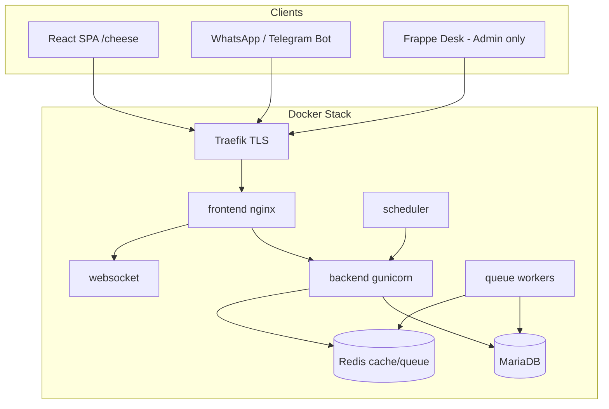
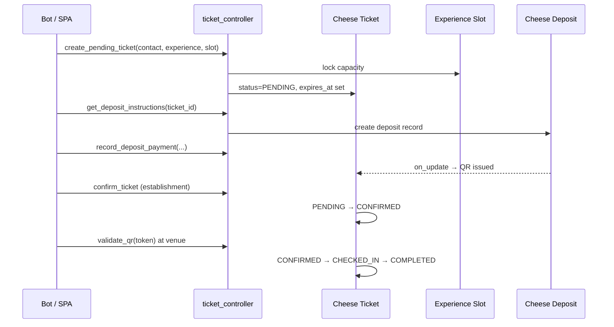

# Architecture & Design

## 1. Purpose

Cheese manages the full lifecycle of tourism and hospitality bookings:

- **Establishments** (companies) publish experiences, time slots, and booking policies.
- **Customers** (contacts) interact via bots or the web SPA to browse, reserve, pay deposits, and check in with QR codes.
- **Route administrators** orchestrate multi-stop itineraries that combine experiences from different establishments.
- **Leads and quotations** capture commercial intent before a reservation is confirmed.

The system is designed for **multi-tenant isolation**: each establishment user sees only their company's data, while route administrators see everything.

---

## 2. Technology Stack & Rationale

| Layer | Choice | Why |
|-------|--------|-----|
| Backend platform | [Frappe Framework v15](https://frappeframework.com) + ERPNext | Mature ERP primitives (Company, User, permissions, scheduler, file storage), rapid DocType development, built-in REST whitelisting |
| Accounting integration | ERPNext Sales Invoice / Payment Entry | Deposits map to standard accounting documents; no custom ledger |
| API style | Frappe whitelisted methods (`/api/method/cheese.api.v1.*`) | Session/API-key auth out of the box; fits bot and SPA clients |
| Frontend SPA | React 18 + Vite + Tailwind + Radix UI | Decoupled UX from Frappe Desk; fast builds; accessible components |
| State / data fetching | TanStack React Query | Cache, refetch, and optimistic updates for list/detail views |
| QR generation | `segno` (pure Python) | No Pillow dependency; lightweight token-based check-in |
| Container runtime | Docker Compose (frappe_docker pattern) | Reproducible staging/production; Traefik TLS termination |
| Observability | Grafana Alloy | Ships Frappe logs from the shared `logs` volume |
| CI/CD | GitHub Actions → GHCR → SSH deploy | Branch-based image tags (`demo` / `latest`) with automated migrations |

**Why not a standalone microservice?** Booking rules, permissions, and ERP accounting are tightly coupled. Frappe DocTypes, document hooks, and the scheduler provide atomic capacity locking, status machines, and background jobs without operating a separate orchestration layer.

---

## 3. Module Structure

```
apps/cheese/
├── cheese/                          # Frappe app package
│   ├── api/v1/                      # REST controllers (whitelisted methods)
│   ├── cheese/
│   │   ├── doctype/                 # Data models (Cheese Ticket, Route, …)
│   │   ├── utils/                   # Business logic (permissions, events, QR, pricing)
│   │   └── scheduler/               # Cron / hourly / daily jobs
│   ├── hooks.py                     # Permissions, doc_events, scheduler, SPA routing
│   ├── patches/                     # Database migrations
│   └── public/frontend/             # Built SPA assets (served at /cheese)
├── frontend/                        # React source (Vite)
├── docs/                            # This documentation
├── scripts/                         # Server init, backup, restore, Alloy config
├── Dockerfile                       # Multi-stage image build
└── docker-compose.yml               # Full production stack
```

### 3.1 Core DocTypes

| DocType | Role |
|---------|------|
| `Cheese Contact` | Single source of truth for customer identity (phone, email, opt-in) |
| `Cheese Experience` | Catalog item offered by an establishment (activity, hotel room, etc.) |
| `Cheese Experience Slot` | Dated capacity unit for an experience |
| `Cheese Booking Policy` | Cancel/modify windows and minimum booking lead time |
| `Cheese Ticket` | Individual reservation with enforced status machine |
| `Cheese Route` | Template combining multiple experiences across establishments |
| `Cheese Route Booking` | Aggregated multi-ticket route reservation |
| `Cheese Deposit` | Payment record linked to ticket or route booking |
| `Cheese QR Token` | Check-in token generated after payment/confirmation |
| `Cheese Lead` / `Cheese Quotation` | Sales funnel before booking |
| `Conversation` | Bot interaction thread linked to contacts and entities |
| `Cheese Attendance` | Check-in record (manual or QR) |
| `Cheese System Event` | Immutable audit trail |

Establishments are modeled as standard ERPNext **Company** records with Cheese-specific custom fields.

### 3.2 Utility Modules

| Module | Responsibility |
|--------|----------------|
| `permissions.py` | Multi-tenant SQL filters and `has_permission` hooks |
| `events.py` | Document hooks: company scoping, route status sync, notifications |
| `lead_automation.py` | Auto-create/update leads from tickets and conversations |
| `qr_utils.py` / `qr_on_payment.py` | Token lifecycle and post-payment QR issuance |
| `validation.py` | Shared input validation for API controllers |
| `notifications.py` | Outbound messages to establishments and customers |
| `pricing.py` | Price and deposit calculation snapshots |

### 3.3 Scheduler Jobs

| Schedule | Job | Purpose |
|----------|-----|---------|
| Every 15 min | `expiration.expire_pending_tickets` | Release capacity from unpaid pending tickets |
| Every 15 min | `deposit_overdue.process_overdue_deposits` | Mark overdue deposits |
| Every 15 min | `completion.auto_complete_checked_in_tickets` | Close out checked-in visits |
| Hourly | `no_show.process_no_shows` | Mark confirmed no-shows after slot window |
| Hourly | `deposit_reminders.send_deposit_reminders` | Remind customers of open deposits |
| Daily | `survey.send_post_completion_surveys` | Post-visit feedback requests |
| Daily | `survey.create_support_cases_for_low_ratings` | Escalate poor survey scores |

---

## 4. Architecture Diagram



---

## 5. Data Flows

### 5.1 Single Experience Reservation



**Status machine** (enforced in `CheeseTicket.validate`):

```
PENDING → CONFIRMED | CANCELLED | EXPIRED | REJECTED
CONFIRMED → CHECKED_IN | CANCELLED | NO_SHOW
CHECKED_IN → COMPLETED
(completed terminal states: COMPLETED, EXPIRED, REJECTED, CANCELLED, NO_SHOW)
```

### 5.2 Route Booking

1. Route admin publishes a `Cheese Route` with ordered `Cheese Route Experience` rows.
2. Bot calls `get_route_combinations` to find compatible slot combinations for a date.
3. `create_route_reservation` creates a `Cheese Route Booking` and child `Cheese Ticket` rows (one per stop).
4. Route-level deposit is collected via `record_route_deposit_payment`.
5. Ticket status changes propagate back to the route booking via `events.update_route_booking_status`.

### 5.3 Lead → Quotation → Reservation

1. Conversation or ticket triggers `lead_automation` → `Cheese Lead` (OPEN).
2. Agent creates `Cheese Quotation` with proposed experiences/dates.
3. Customer accepts → `accept_quotation` creates pending tickets.
4. Standard deposit and confirmation flow continues.

### 5.4 QR Check-in

1. Deposit verified or ticket confirmed → `qr_on_payment.on_deposit_paid` generates `Cheese QR Token`.
2. Customer presents token → `qr_controller.validate_qr` creates `Cheese Attendance` and advances ticket to `CHECKED_IN`.

---

## 6. API Surface

All endpoints are exposed as Frappe whitelisted methods:

```
POST/GET /api/method/cheese.api.v1.<controller>.<function>
Authorization: token <api_key>:<api_secret>
```

Import the [Postman collection](../Cheese_Bot_API.postman_collection.json) for request/response examples.

### 6.1 Controllers

| Controller | Key functions |
|------------|---------------|
| `auth_controller` | `token`, `session`, `logout` |
| `contact_controller` | `find_or_create_contact`, `update_contact`, `get_contact_profile`, … |
| `conversation_controller` | `open_or_resume_conversation`, `append_conversation_event`, … |
| `lead_controller` | `upsert_lead`, `convert_lead_to_reservation`, … |
| `establishment_controller` | `list_establishments`, `create_establishment`, … |
| `experience_controller` | `list_experiences`, `create_time_slot`, `create_recurring_slots`, … |
| `availability_controller` | `get_availability`, `get_route_availability`, … |
| `pricing_controller` | `get_pricing_preview`, `get_cancellation_impact`, … |
| `ticket_controller` | `create_pending_ticket`, `confirm_ticket`, `cancel_ticket`, … |
| `route_controller` | `create_route`, `publish_route`, `configure_route_deposit`, … |
| `route_booking_controller` | `get_route_combinations`, `create_route_reservation`, … |
| `booking_controller` | `create_pending_booking` (mixed/multi-item), … |
| `deposit_controller` | `get_deposit_instructions`, `record_deposit_payment`, `verify_deposit`, … |
| `qr_controller` | `get_qr`, `validate_qr`, `resend_qr`, `revoke_qr` |
| `attendance_controller` | `manual_check_in`, `list_attendance`, … |
| `hotel_controller` | `get_hotel_availability`, `bot_book_hotel_room`, … |
| `quotation_controller` | `create_quotation`, `accept_quotation`, … |
| `survey_controller` | `submit_survey`, `get_survey_analytics`, … |
| `complaint_controller` | `create_complaint`, `list_support_cases`, … |
| `dashboard_controller` | `get_central_dashboard`, `get_establishment_dashboard`, … |
| `user_controller` | `create_user`, `list_users`, … |
| `document_controller` | `upload_document`, `list_documents`, … |
| `opt_in_controller` | `update_opt_in_status`, `bulk_update_opt_in` |
| `itinerary_controller` | `get_customer_itinerary` |
| `bank_account_controller` | `get_entity_bank_account` |
| `message_controller` | `upload_message_transcript` |

Guest-accessible endpoints (no login): `auth_controller.token`, selected `hotel_controller.bot_*` methods.

### 6.2 Response Convention

Controllers return a consistent envelope:

```json
{
  "success": true,
  "message": "Human-readable summary",
  "data": { }
}
```

Errors raise `frappe.throw` or return `success: false` with an HTTP 4xx/5xx status.

---

## 7. Security & Multi-Tenancy

- **Route Administrator** / **Central Admin**: unrestricted read/write across companies.
- **Establishment User**: scoped via Frappe `User Permission` rows (`allow = Company`).
- `permission_query_conditions` in `hooks.py` inject SQL filters on list queries.
- `has_permission` callables block direct document access by ID.
- API controllers additionally call helpers in `access.py` for establishment-scoped endpoints.
- Frappe Desk (`/app`) is restricted to Administrator; operators use the Cheese SPA at `/cheese`.

See `cheese/cheese/utils/permissions.py` for the authoritative role and scoping logic.

---

## 8. Frontend SPA

- Source: `frontend/` (Vite + React Router).
- Build output copied to `cheese/public/frontend/` and served via `cheese/www/cheese.html`.
- `website_path_resolver` in hooks rewrites `/cheese/*` paths for client-side routing.
- API client (`frontend/src/api/client.js`) stores API key/secret in `localStorage` after `auth_controller.token`.
- i18n: English and Spanish via `react-i18next`.

---

## 9. External Integrations

| Integration | Usage |
|-------------|-------|
| ERPNext Company / User | Establishments and operator accounts |
| ERPNext accounting | Deposit reconciliation (optional Sales Invoice linkage) |
| AWS S3 | Automated database + file backups (`scripts/backup.sh`) |
| Grafana Alloy | Log shipping from Docker `logs` volume |
| Conversational channels | Bots consume the v1 API; transcripts uploaded via `message_controller` |
