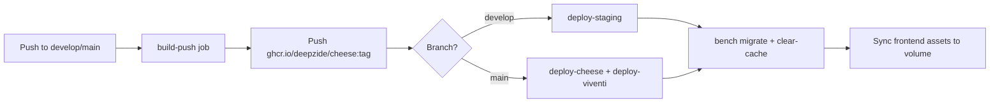

# Configuration & Deployment

## 1. Prerequisites

| Requirement | Version / Notes |
|-------------|-----------------|
| Docker + Docker Compose | v2 recommended |
| GitHub PAT (`GH_PAT`) | Pull images from `ghcr.io/deepzide/cheese` |
| SSH access | Deploy jobs connect as `root` to target servers |
| Domain + DNS | A record pointing to server IP for Traefik TLS |
| AWS credentials (optional) | S3 backups via `scripts/backup.sh` |

**Bundled apps** (installed at site creation): `erpnext`, `hrms`, `payments`, `cheese`.

---

## 2. Environment Variables

Server `.env` file lives at `/opt/erpnext/.env` (generated by `setup-server.sh` or CI).

| Variable | Required | Description | Example |
|----------|----------|-------------|---------|
| `TAG` | Yes | Docker image tag | `demo` (staging) / `latest` (production) |
| `DEPLOY_ENV` | Yes | Environment label for backups & Alloy | `staging` / `production` |
| `SITES_RULE` | Yes | Traefik host rule | `` Host(`erp-cheese.deepzide.com`) `` |
| `DOMAIN` | Yes | Public hostname | `erp-cheese.deepzide.com` |
| `LETSENCRYPT_EMAIL` | Yes | ACME registration email | `admin@example.com` |

Reference template: [`.env.example`](../.env.example).

### 2.1 Docker Compose Internal Variables

These are set in `docker-compose.yml` and normally do not need changing:

| Variable | Service | Purpose |
|----------|---------|---------|
| `DB_HOST`, `DB_PORT` | backend, configurator | MariaDB connection |
| `MYSQL_ROOT_PASSWORD` | db | Database root password (default `admin` in compose) |
| `REDIS_CACHE`, `REDIS_QUEUE` | configurator, workers | Redis URLs |
| `BACKEND`, `SOCKETIO` | frontend nginx | Upstream routing |
| `FRAPPE_SITE_NAME_HEADER` | frontend | Site name header (`frontend`) |

### 2.2 Frontend Build-Time Variables

| Variable | File | Purpose |
|----------|------|---------|
| `VITE_API_BASE_URL` | `frontend/.env` | Default API base URL for local Vite dev |

Production SPA uses same-origin requests (empty base URL); the login screen can override the stored URL.

### 2.3 CI / Init Script Variables

| Variable | Used by | Purpose |
|----------|---------|---------|
| `GH_PAT` | `init-server.sh`, Docker build secret | GHCR login and private repo clone |
| `AWS_ACCESS_KEY_ID` / `AWS_SECRET_ACCESS_KEY` | `setup-server.sh`, `backup.sh` | S3 upload |
| `AWS_S3_BUCKET` | `backup.sh` | Bucket name (default `deepzide-backups`) |
| `TAG_OVERRIDE` | `init-server.sh` | Force custom image tag on first setup |
| `DOMAIN`, `LETSENCRYPT_EMAIL` | `init-server.sh` | Passed to `setup-server.sh` |

---

## 3. External Dependencies

### 3.1 Python (`pyproject.toml`)

| Package | Purpose |
|---------|---------|
| `segno` | QR code generation |
| `frappe` / `erpnext` | Installed by bench in the base image (not pinned in app deps) |

### 3.2 Node (`frontend/package.json`)

Key runtime dependencies: React 18, Vite 6, TanStack Query, Radix UI, Tailwind CSS, `html5-qrcode`, `i18next`.

### 3.3 Infrastructure Images (`docker-compose.yml`)

| Service | Image |
|---------|-------|
| Application | `ghcr.io/deepzide/cheese:${TAG}` |
| Database | `mariadb:10.11` |
| Redis | `redis:6.2-alpine` |
| Reverse proxy | `traefik:v3.6` |
| Log agent | `grafana/alloy:latest` |

---

## 4. Installation Scripts

| Script | Run from | Purpose |
|--------|----------|---------|
| [`scripts/init-server.sh`](../scripts/init-server.sh) | Developer laptop | One-shot new server bootstrap over SSH |
| [`scripts/setup-server.sh`](../scripts/setup-server.sh) | Target server | Install Docker, write `.env`, configure AWS cron |
| [`scripts/backup.sh`](../scripts/backup.sh) | Target server (cron) | `bench backup` + S3 upload |
| [`scripts/restore.sh`](../scripts/restore.sh) | Target server | Restore from S3 backup |
| [`scripts/alloy-config.alloy`](../scripts/alloy-config.alloy) | Mounted in Alloy container | Log scraping rules |

### 4.1 First-Time Server Setup

```bash
export GH_PAT='ghp_...'
export AWS_ACCESS_KEY_ID='...'      # optional
export AWS_SECRET_ACCESS_KEY='...'  # optional
export DOMAIN='erp-cheese.example.com'
export LETSENCRYPT_EMAIL='admin@example.com'

./scripts/init-server.sh <server-ip> staging   # or production
```

Then push to `develop` (staging) or `main` (production) to trigger CI deploy, or manually:

```bash
ssh root@<server-ip> 'cd /opt/erpnext && docker compose up -d'
```

### 4.2 Local Bench Development (without Docker)

```bash
cd $BENCH_PATH
bench get-app /path/to/apps/cheese
bench --site mysite.local install-app cheese
cd apps/cheese/frontend && npm ci && npm run build
bench build --app cheese
bench --site mysite.local migrate
```

---

## 5. Docker Image Build

Multi-stage [`Dockerfile`](../Dockerfile):

1. **builder** — clones app, `pip install -e .`, `npm run build`, `bench build --app cheese`
2. **backend** — slim runtime with pre-built bench tree

Build args: `FRAPPE_BRANCH` (default `version-15`), `APP_BRANCH`, `CACHE_BUST`.

Image published to `ghcr.io/deepzide/cheese:<tag>` by [`.github/workflows/build-push.yml`](../.github/workflows/build-push.yml).

---

## 6. CI/CD Pipeline



| Trigger | Image tag | Deploy job | Target |
|---------|-----------|------------|--------|
| Push to `develop` | `demo` | `deploy-staging` | `62.171.181.244` → `erp-cheese-dev.deepzide.com` |
| Push to `main` | `latest` | `deploy-cheese` | `217.76.58.119` → `erp-cheese.deepzide.com` |
| Push to `main` | `latest` | `deploy-viventi` | `144.91.95.172` → `erp-viventi.deepzide.com` |

Each deploy:

1. Copies `docker-compose.yml`, `backup.sh`, `restore.sh`, and `.env` to `/opt/erpnext/`
2. `docker compose pull && docker compose up -d --force-recreate`
3. Creates site if missing (`docker compose run --rm create-site`)
4. Runs `bench --site frontend migrate`
5. Clears cache and syncs built assets into the `sites-assets` volume

Manual workflow dispatch is also supported (`workflow_dispatch`).

---

## 7. Environment Procedures

### 7.1 Staging (QA)

| Item | Value |
|------|-------|
| Branch | `develop` |
| Image | `ghcr.io/deepzide/cheese:demo` |
| URL | `https://erp-cheese-dev.deepzide.com` |
| Purpose | Feature QA, bot integration testing, migration dry-runs |

**QA checklist before promoting to production:**

1. Run Postman collection against staging (`Cheese_Bot_API.postman_collection.json`).
2. Verify multi-tenant isolation with establishment test users.
3. Exercise full booking flow: pending → deposit → confirm → QR check-in.
4. Test route booking with multi-experience combinations.
5. Confirm scheduler jobs (expire pending tickets after timeout).
6. Review migration output: `docker compose exec backend bench --site frontend migrate --dry-run` (if supported) or inspect migrate logs.
7. Smoke-test SPA at `/cheese` (login, list tickets, create experience).

### 7.2 Production

| Item | Value |
|------|-------|
| Branch | `main` |
| Image | `ghcr.io/deepzide/cheese:latest` |
| URLs | `erp-cheese.deepzide.com`, `erp-viventi.deepzide.com` |
| GitHub environment | `production` (requires approval for deploy jobs) |

**Production deploy rules:**

- Merge to `main` only from tested `develop` commits.
- Deploy runs automatically; monitor GitHub Actions logs.
- Post-deploy: verify `/api/method/cheese.api.v1.auth_controller.session` and SPA load.
- Backups run at **00:00 and 12:00 UTC** when AWS is configured.

### 7.3 Rollback

```bash
# On the server
cd /opt/erpnext

# Pin to a previous image tag
echo 'TAG=<previous-sha-or-tag>' >> .env   # edit .env appropriately
docker compose pull
docker compose up -d --force-recreate

# Restore database if needed
./restore.sh <s3-backup-path>
docker compose exec backend bench --site frontend migrate
```

Use [`.github/workflows/restore.yml`](../.github/workflows/restore.yml) for documented restore automation.

---

## 8. Operations Reference

### 8.1 Useful Commands

```bash
# Stack status
docker compose ps

# Application logs
docker compose logs -f backend

# Run bench command
docker compose exec backend bench --site frontend console

# Manual backup
/opt/erpnext/backup.sh

# Clear caches after config change
docker compose exec backend bench --site frontend clear-cache
docker compose exec backend bench --site frontend clear-website-cache
```

### 8.2 Persistent Volumes

| Volume | Contents |
|--------|----------|
| `sites` | Site config, private files, backups |
| `sites-assets` | Built JS/CSS assets |
| `db-data` | MariaDB data directory |
| `logs` | Frappe application logs (Alloy reads this) |
| `cert-data` | Traefik ACME certificates |

### 8.3 Monitoring

Grafana Alloy container tails the shared `logs` volume using `alloy-config.alloy`. Set `DEPLOY_ENV` so log streams can be labeled by environment.

---

## 9. Developer Container Setup (Reference)

The root [`README.md`](../README.md) describes the **For Developers** Docker bootstrap using `apps.json` and `custom.txt` to pin Frappe app versions. That path is for building custom bench images; the production Cheese stack uses the pre-built `ghcr.io/deepzide/cheese` image instead.
